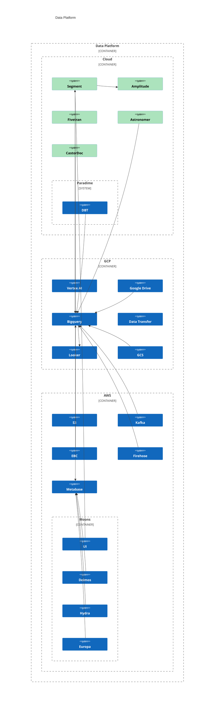

```mermaid
C4Context
      title Data Platform
      Container_Boundary(b0, "Data Platform") {

        Container_Boundary(cloud, "Cloud"){
            System(segment, "Segment")
            System(amplitude, "Amplitude")
            System(fivetran, "Fivetran")
            System(astronomer, "Astronomer")
            System(castor, "CastorDoc")

            System_Boundary(paradime, "Paradime"){
                System(dbt, "DBT")
            }

        }

        Container_Boundary(gcp, "GCP"){
            System(vertexai, "Vertex AI")
            System(drive, "Google Drive")
            System(bq, "Bigquery")
            System(datatransfer, "Data Transfer")
            System(looker, "Looker")
            System(gcs, "GCS")
        }

        Container_Boundary(aws, "AWS"){
            
            Container_Boundary(moons, "Moons"){
                System(ui, "UI")
                System(deimos, "Deimos")
                System(hydra, "Hydra")
                System(europa, "Europa")
            }
            System(awss3, "S3")
            System(kafka, "Kafka")
            System(ebc, "EBC")
            System(firehose, "Firehose")
            System(metabase, "Metabase")
        }

          
      }

      Rel(fivetran, bq, "")
      Rel(segment, amplitude, "")
      Rel(segment, bq, "")
      Rel(ui, segment, "")
      Rel(gcs, bq, "")
      Rel(drive, bq, "")
      Rel(dbt, bq, "")
      Rel(castor, bq, "")
      Rel(bq, looker, "")
      Rel(bq, metabase, "")
      Rel(ebc, bq, "")
      Rel(firehose, bq, "")
      Rel(kafka, bq, "")
      Rel(bq, metabase, "")
      Rel(bq, looker, "")
      Rel(astronomer, bq, "")
      Rel(deimos, metabase, "")
      Rel(hydra, metabase, "")
      Rel(europa, metabase, "")
      

      UpdateLayoutConfig($c4ShapeInRow="6", $c4BoundaryInRow="1")
    %%   UpdateElementStyle(cloud, $bgColor="lightgrey")
      UpdateElementStyle(segment, $bgColor="#ACE3BD", $fontColor="black")
      UpdateElementStyle(amplitude, $bgColor="#ACE3BD", $fontColor="black")
      UpdateElementStyle(fivetran, $bgColor="#ACE3BD", $fontColor="black")
      UpdateElementStyle(astronomer, $bgColor="#ACE3BD", $fontColor="black")
      UpdateElementStyle(castor, $bgColor="#ACE3BD", $fontColor="black")
      

```